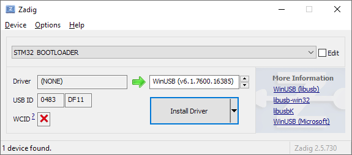

# Relacon Relay Controller Firmware

## Overview

The [Relacon relay controller](https://github.com/fjenner/Relacon-HW) is a USB relay controller board designed as a low-cost, open source alternative to the OnTrak ADU218. It utilizes the same USB protocol as the ADU218 and should be compatible with existing software written for that product.

This repository contains the source code for the microcontroller firmware for the current version (Rev 1) of the Relacon relay controller hardware.

## License

This software is licensed under the open source 3-clause BSD License. Please see the [LICENSE](LICENSE) file for full license information.

This project also leverages several other open source projects (see the [external](external) directory) with compatible open source licenses. Please see those respective projects for their licensing information.

## Building the Firmware

### Fetching the Sources

This project relies on several other open source projects included as git submodules. To clone and check out this repository and all necessary submodules for building the firmware, run the following commands:

```console
$ git clone git@github.com:fjenner/Relacon-FW.git
$ cd Relacon-FW
$ git submodule update --init
```

Note that it is _not_ advised to do a recursive clone of the submodules, as this would pull in an excessive amount of unnecessary code. The TinyUSB submodule, for example, would pull in third-party vendor repositories for all supported devices.

### Basic Build

Building this firmware requires that a bare metal ARM GCC toolchain (i.e. `arm-none-eabi`) is installed on the build machine and is in the `PATH`. The build should work both on Linux and on Windows build hosts running MSYS2. To build the firmware, simply run "make" on the command line:

```console
$ make
```

By default, the build will generate two flavors of output files, `Relacon.elf` and `Relacon.bin`, which can be used to flash the firmware using an ST programmer. Alternatively, the ST DFU bootloader built in to the MCU can be used to flash the device directly through the board's USB interface, as described below.

### Configuring the USB Descriptors

A few USB descriptor fields are likely to be candidates that you may want to change. Three such candidates are the vendor ID, the product ID, and the serial number. These are exposed as makefile variables that can be overridden on the make command line. The variables and their default values are shown below:

Makefile Variable Name | Default Value
-----------------------|--------------
`USB_DESCRIPTORS_VENDOR_ID` | 0x1209 ([pid.codes vendor ID](https://pid.codes/1209/))
`USB_DESCRIPTORS_PRODUCT_ID` | 0xfa70 ([Relacon product ID from pid.codes](https://pid.codes/1209/FA70/))
`USB_DESCRIPTORS_STRING_SERIAL_NUM` | "A12345"

To override any of these, simply assign one or more of them on the make command line when building the firmware; for example:

```console
$ make USB_DESCRIPTORS_VENDOR_ID=0x1234 USB_DESCRIPTORS_PRODUCT_ID=0x5678 USB_DESCRIPTORS_STRING_SERIAL_NUM="XYZ123"
```

If the firmware has already been built, you will need to clean (`make clean`) and rebuild with the new values in order for them to take effect.

For additional control over the USB descriptors, the [UsbDescriptors.c](src/UsbDescriptors.c) source file can be modified accordingly.

### Enabling UART Debug Output

During development, it may be useful to instrument the code with debug output that can be viewed on a PC over a serial connection. The `ENABLE_UART_DEBUG` makefile is available for this purpose. Set this variable to 1 on the make command line when building the firmware to enable debug output from various areas of the firmware through the use of the `BoardDebugPrint()` function:

```console
$ make ENABLE_UART_DEBUG=1
```
## Flashing the Firmware Using the DFU Bootloader


### Booting the Hardware into DFU Bootloader Mode

Before the DFU flashing can occur, the hardware must be booted into the DFU bootloader mode. To do so, first disconnect the device from the USB port. Use a jumper wire to short the `PB8` pin to the `+3V3` pin on the expansion header (this effectively asserts the `BOOT0` boot mode pin). Re-connect the device to the USB port, and it should enumerate in DFU (device firmware upgrade) mode.

After flashing the device, described below, remove the jumper and disconnect/reconnect the device to the USB port to operate with the newly-flashed firmware.

The current hardware revision (the Relacon Rev 1 board) has a small design defect related to the boot mode pin, so please see [this link](https://github.com/fjenner/Relacon-HW#boot0-pin-is-floating) for additional information.

### DFU Flashing Software and Drivers

Using the DFU bootloader is the preferred approach for flashing this device, as it does not require any additional programming hardware. It does, however, require the open source [dfu-util](http://dfu-util.sourceforge.net/) software package, which is available both for Linux distributions and for MSYS2 under Windows.

On Linux, no explicit driver is required for communicating with the device in DFU mode. However, on Windows, `dfu-util` requires the device to have a libusb-compatible driver when running in DFU mode (the driver is only required for firmware flashing; the default Microsoft HID driver is used during normal operation as a relay controller). Using [Zadig](https://zadig.akeo.ie/) is the preferred approach for installing the driver for the DFU device on Windows. In the Zadig application, be sure that the selected device is "STM32 BOOTLOADER" and the selected driver is WinUSB, as shown below.



As an alternative to` dfu-util` on Windows, the free ST [DfuSe](https://www.st.com/en/development-tools/stsw-stm32080.html) application and corresponding driver can be used to flash the firmware, though the use of those tools is outside of the scope of this document.

### Building and Flashing the DFU File

The ST DFU bootloader and associated host software requires a .dfu file that contains the flashing information in a particular format. Such a file can be built using the `Relacon.dfu` makefile target, as follows:

```console
$ make Relacon.dfu
```

This makefile target relies on a small Python script (see [mkdfu.py](tools/mkdfu.py)), so Python3 must be installed on the build host for this target to work. (The `DfuFileMgr` GUI application from the ST DfuSe package could be used to create the .dfu file from the .bin file, but is GUI-only and Windows-only. The `dfuse-pack.py` script from the `dfu-util` sources also accomplishes the same thing, though this script is not included in many distributions of the package, hence the use of an original script).

To flash the firmware using the `dfu-util` software, simply use the `program` makefile target on the command line:

```console
$ make program
```

The `program` target actually implicitly builds the `Relacon.dfu` target, so it is not necessary to build the file explicitly as a separate step when using the `program` target.
